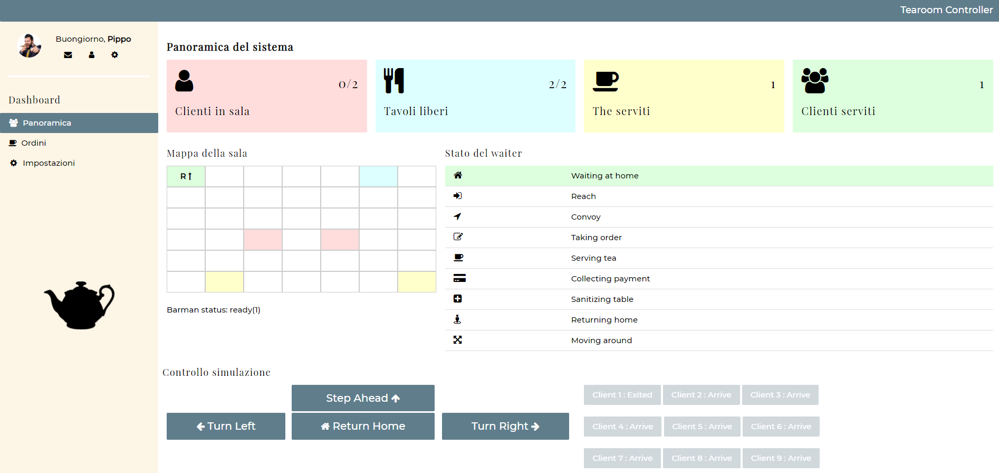

# iss2020TemaFinale
Esame di Ingegneria dei Sistemi Software A.A. 2019/2020

## Introduzione

[**Analisi**](http://htmlpreview.github.io/?https://github.com/ugoleone/iss2020TemaFinale/blob/master/Relazioni/Analisi/analisi.html)

[**Requisiti**](http://htmlpreview.github.io/?https://github.com/ugoleone/iss2020TemaFinale/blob/master/Relazioni/Requisiti/Requisiti.html)

Il *manager* di una sala da the (*tearoom*) vorrebbe regolare l'accesso al servizio impiegando un DDR robot (*waiter*).

La *tearoom* è una stanza rettangolare che include:

- una porta di entrata (*entrancedoor*) per entrare nella stanza ed una di uscita (*exitdoor*) per uscire;
- un numero `N (N=2)` di tavoli (*teatable*);
- una *servicearea* che include a sua volta un *servicedesk* al quale lavora un *barman*;
- una *hall* provvista di un *presencedetector*, ad esempio un dispositivo (come un sonar) che può rilevare la presenza di una persona (o di qualche altra entità) davanti a se.

Il *waiter* può muoversi liberamente lungo i bordi della stanza, poichè lungo il perimetro non ci sono ostacoli.

Il *manager* deve poter visualizzare lo stato corrente (*current state*) della *tearoom* usando un browser connesso ad un server web associato all'applicazione.

## Piano di lavoro

Dalla analisi preliminare del sistema risulta necessario pianificare un piano di lavoro architettato in sprint, di seguito riportati.

| NOME                                                         | DESCRIZIONE                                                  | MOTIVAZIONE                                                  |
| ------------------------------------------------------------ | ------------------------------------------------------------ | ------------------------------------------------------------ |
| [**SPRINT 1**](http://htmlpreview.github.io/?https://github.com/ugoleone/iss2020TemaFinale/blob/master/Relazioni/Sprint1/sprint1.html) | Si occupa della modellazione del sistema nell'ipotesi in cui operi un solo client e che compia unicamente le azioni previste dal suo comportamento standard, senza interferenze di alcun genere. | La scelta di questo primo sprint è motivata dalla volontà di simulare un primo scenario di base che preveda una interazione "controllata" e "prevista" del sistema, in modo da aggiungere nei successivi sprint i casi imprevisti. |
| [**SPRINT 2**](http://htmlpreview.github.io/?https://github.com/ugoleone/iss2020TemaFinale/blob/master/Relazioni/Sprint2/sprint2.html) | Si occupa della definizione dello stato della stanza.  Questo sprint aggiunge al primo sprint una descrizione degli elementi della stanza, introducendo il concetto di **architettura esagonale**.  Inoltre in questo sprint si inizia a costruire il pannello di controllo da fornire al manager. | Dopo aver verificato le funzionalità base del sistema è necessario iniziare a dare una forma a quella che sarà l'architettura finale. |
| **SPRINT 3**                                                 | Si occupa della **concorrenza** fra client, ossia la presenza di più client nella *tearoom* contemporaneamente. | Dopo aver costruito una prima versione dell'architettura finale, aggiungiamo al sistema ulteriori casi d'uso con lo scopo di avvicinarlo sempre più al prodotto finale richiesto. |
| **SPRINT 4**                                                 | Aggiunge alla precedente architettura le situazioni impreviste non precedentemente trattate (ad esempio comportamenti inaspettati del client) e i requisiti facoltativi. | Questo sprint finale aggiunge all' architettura le ultime modifiche con lo scopo di renderla più resistente nel caso di situazioni impreviste. |

## Our Team

**Ugo Leone Cavalcanti** ( [ugoleone.cavalcanti@studio.unibo.it](MAILTO:ugoleone.cavalcanti@studio.unibo.it) )

**Amir Al Sadi** ( [amir.alsadi@studio.unibo.it](MAILTO:amir.alsadi@studio.unibo.it) )

**Nicolò Romandini** ( [nicolo.romandini@studio.unibo.it](MAILTO:nicolo.romandini@studio.unibo.it) )